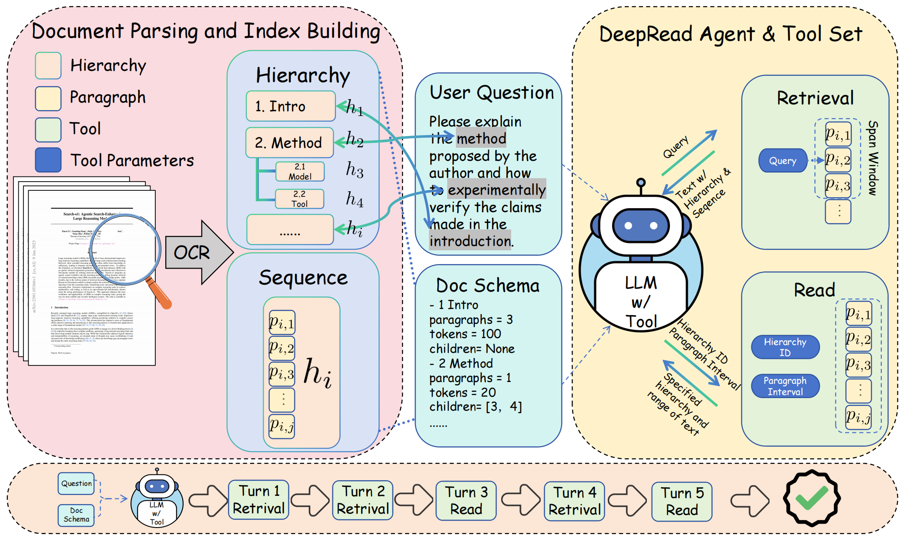

# DeepRead

[**DeepRead: Document Structure-Aware Reasoning to Enhance Agentic Search**](https://arxiv.org/pdf/2602.05014v1)
<div style="text-align:center;">
    
</div>

DeepRead is a document-structure-aware RAG Agent. This repo already includes the core parsing, indexing, retrieval, and agent runtime used in the demo.

## Highlights
- Structure-aware parsing: preserves headings, tables, and images from Markdown into hierarchical nodes.
- Multi tools for retrieval: BM25 / Regex / Vector / Hybrid / Semantic pipeline with configurable top-k.
- Neighbor-window reading: expand retrieved nodes with structural context.
- Optional multimodal reads: image blocks can be surfaced to the model (`--enable-multimodal`).
- Tool-call fallback parsing: robust handling of tool calls in multiple formats.

## Repository Layout
- `Code/DeepRead.py`: agent runtime + retrieval + tool calls.
- `Code/parser_pdf.py`: PDF -> OCR (PaddleOCRVL) -> merged Markdown/JSON -> corpus; optional embeddings.
- `Code/paddleocr.sh`: Docker-based PaddleOCRVL vLLM server runner.
- `Demo/TradingAgent/`: demo corpus + embeddings (with images).
- `Demo/金山办公2023年报/`: demo corpus + embeddings.

## Quickstart
### 0) Set API Environment Variables
Set these before running `DeepRead.py` (adjust to your provider):
```bash
# LLM (choose one provider)
export OPENAI_API_KEY="<YOUR_OPENAI_KEY>"
# or
export OPENROUTER_API_KEY="<YOUR_OPENROUTER_KEY>"

# override base URL / model
export OPENAI_BASE_URL="https://api.openai.com/v1"
export OPENAI_MODEL="gpt-4o"

# Optional: Embedding service
export EMBED_API_KEY="<YOUR_EMBEDDING_KEY>"
export EMBED_BASE_URL="http://127.0.0.1:8756/v1"
export EMBEDDING_MODEL="Qwen/Qwen3-Embedding-8B"

# Optional: Reranker service (for semantic retrieval)
export RERANK_API_KEY="<YOUR_RERANK_KEY>"
export RERANK_BASE_URL="https://api.siliconflow.cn/v1"
export RERANK_MODEL="Qwen/Qwen3-Reranker-8B"
```

### 1) Start PaddleOCRVL server for PDF OCR
If you want to parse PDFs, please read the PaddleOCRVL setup first, then start the OCR server:
https://huggingface.co/PaddlePaddle/PaddleOCR-VL

We use the official PaddleOCRVL Docker image published by PaddlePaddle. The launcher is provided in `Code/paddleocr.sh`. Run:
```bash
bash Code/paddleocr.sh
```
By default it exposes `http://127.0.0.1:8956/v1`.

### 2) PDF -> Corpus (Structure-Aware)
```bash
python Code/parser_pdf.py \
  --input /path/to/your.pdf \
  --output /path/to/output_dir
```
Optional embeddings (requires an embedding API server):
```bash
python Code/parser_pdf.py \
  --input /path/to/your.pdf \
  --output /path/to/output_dir \
  --build-embeddings \
  --embedding-model Qwen/Qwen3-Embedding-8B \
  --embed-base-url http://127.0.0.1:8756/v1 \
  --embed-api-key <YOUR_KEY>
```
This produces:
- `*_corpus.json` (structured nodes)
- `*_emb.npy` + `*_idmap.json` (optional vector store)

### 3) Ask Questions with DeepRead
Run:
```bash
python Code/DeepRead.py \
  --doc /path/to/output_dir/your_corpus.json \
  --question "What is your question?" \
  --enable-semantic \
  --neighbor-window 1,-1 \
  --log run_log.jsonl
```

### 4) Recommended Retrieval Modes
Choose a retrieval mode based on your service availability:
- **No Embedding API**: use BM25 (available by default, no extra flags)
  ```bash
  python Code/DeepRead.py --doc /path/to/your_corpus.json --question "..." --log run_log.jsonl
  ```
- **Embedding API only (no reranker)**: use Vector retrieval
  ```bash
  python Code/DeepRead.py \
    --doc /path/to/your_corpus.json \
    --question "..." \
    --enable-vector \
    --disable-bm25 \
    --disable-regex \
    --log run_log.jsonl
  ```
- **Embedding + Reranker**: use Semantic retrieval (vector recall + rerank)
  ```bash
  python Code/DeepRead.py \
    --doc /path/to/your_corpus.json \
    --question "..." \
    --enable-semantic \
    --log run_log.jsonl
  ```

## Demo
### Demo 1: TradingAgent (multimodal + embeddings)
```bash
python Code/DeepRead.py \
  --doc "Demo/TradingAgent/TradingAgent_corpus.json" \
  --question "Which roles are included in the overall TradingAgents framework?" \
  --enable-semantic \
  --enable-multimodal \
  --log demo_trading.jsonl
```

### Demo 2: 金山办公23年年报
```bash
python Code/DeepRead.py \
  --doc "Demo/金山办公2023年报/11724-金山办公：金山办公2023年年度报告_corpus.json" \
  --question "公司有哪些累计投入金额超过一亿元的在研项目？" \
  --enable-semantic \
  --neighbor-window 0,0 \
  --log demo_xx.jsonl
```

## Full Usage
### DeepRead.py
All options:
```bash
python Code/DeepRead.py --help
```
Common flags:
- Input/basics: `--doc`, `--question`, `--log`, `--max_rounds`, `--temperature`
- Retrieval toggles: `--enable-vector`, `--enable-hybrid`, `--enable-semantic`, `--disable-bm25`, `--disable-regex`, `--disable-read`
- Semantic retrieval: `--semantic-stage1` (vector/bm25/hybrid), `--semantic-topk1`, `--semantic-topk2`
- Neighbor window: `--neighbor-window up,down`
- Multimodal: `--enable-multimodal`
- Embedding: `--embedding-model`, `--embed-base-url`, `--embed-api-key`
- Rerank: `--rerank-api-key`, `--rerank-base-url`, `--rerank-model`

### parser_pdf.py
All options:
```bash
python Code/parser_pdf.py --help
```
Common flags:
- Input/output: `--input` (PDF), `--output`
- OCR server: `--paddle-vl-rec-backend`, `--paddle-vl-rec-server-url`
- Embedding: `--build-embeddings`, `--embedding-model`, `--embedding-batch-size`, `--embed-base-url`, `--embed-api-key`

## Configuration Reference
DeepRead reads from environment variables and CLI flags:
- LLM: `OPENAI_API_KEY` / `OPENROUTER_API_KEY`, `OPENAI_BASE_URL` / `OPENROUTER_BASE_URL`, `OPENAI_MODEL`
- Embedding: `EMBED_API_KEY`, `EMBED_BASE_URL`, `EMBEDDING_MODEL`
- Rerank (optional): `RERANK_API_KEY` or `SILICONFLOW_API_KEY`, `RERANK_BASE_URL`, `RERANK_MODEL`
- Retrieval: `--enable-vector`, `--enable-hybrid`, `--enable-semantic`, `--disable-bm25`, `--disable-regex`, `--disable-read`
- Neighbor window: `--neighbor-window up,down` (e.g. `1,-1`, `0,0` disables)

## Notes
- `parser_pdf.py` currently accepts PDF only.
- OCR requires `paddleocr` and `PaddleOCRVL` (or run the provided Docker server).
- `tiktoken` is optional; if missing, token counting falls back to a simple tokenizer.

## License
See `LICENSE`.
